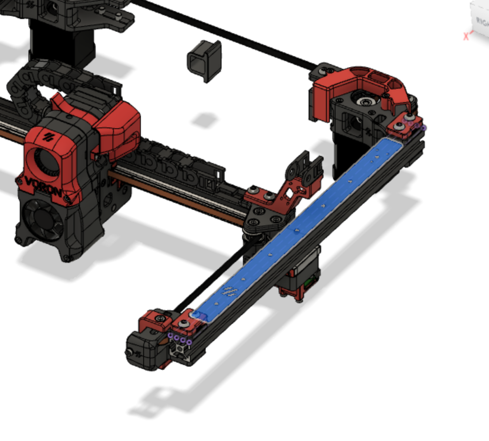
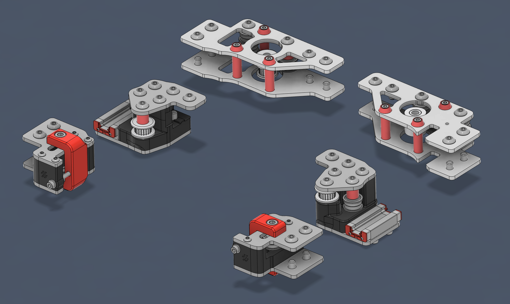
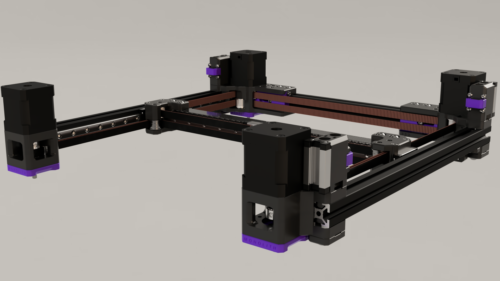
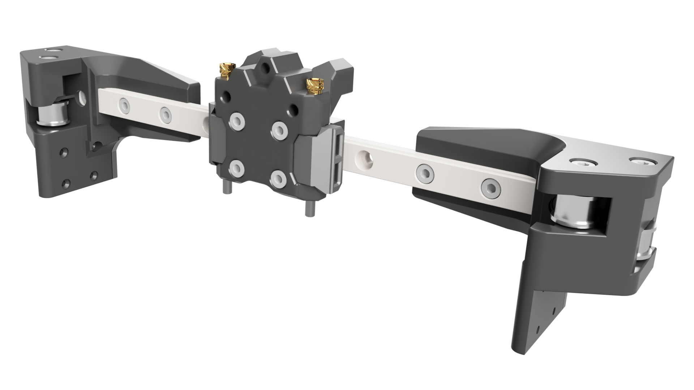

# Gantry

## Standard 2.4 mod

<figure><figcaption>
<a href="https://github.com/VoronDesign/VoronUsers/tree/main/printer_mods/whoppingpochard/extrusion_backers">Extrusion backers</a>
</figcaption></figure>

## Standard Trident mod

<figure><figcaption>
<a href="https://github.com/3DPrintingMods/VoronTrident-AluminumG">Aluminum Gantry (6mm and 9mm belts) for Voron Tri</a>dent
</figcaption></figure>

## Heavy 2.4 mod

<figure><figcaption>
<a href="https://github.com/CloakedWayne/Monolith_Gantry_V2-VT/tree/main">Monolith gantry /!\ WIP</a>
</figcaption></figure>

## Standard 0 mod

<figure><figcaption>
<a href="https://github.com/zruncho3d/vampire_bat">Vampire</a>
</figcaption></figure>

