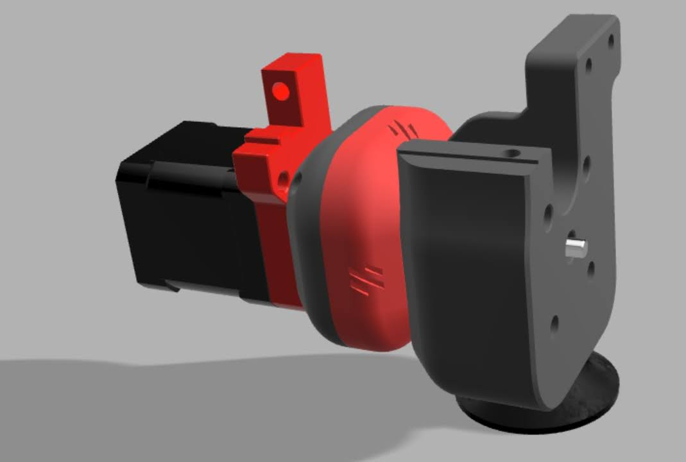

# Z axis

## Z motor

<figure><figcaption>
<a href="https://github.com/ocgeek/Voron_2.4_Galileo/tree/main">Galileo Z</a>
</figcaption></figure>

<figure><figcaption>
<a href="https://github.com/JaredC01/Galileo2/tree/main/galileo2_z">Galileo2Z (G2Z; G2ZXL)</a>
</figcaption></figure>

<figure><figcaption>
<a href="https://github.com/VoronDesign/VoronUsers/tree/38d475bbd811b366801ba501357c17aa77b5e282/abandoned_mods/printer_mods/edwardyeeks/V2.4_z_drive_motor_tensioner_mod">2.4 Z motor tensioner</a>
</figcaption></figure>

## Z joint

<figure><figcaption>
<a href="https://github.com/hartk1213/MISC/tree/main/Voron%20Mods/Voron%202-Trident/2.4/Voron2.4_GE5C">GE5C</a>
</figcaption></figure>

<figure><figcaption>
<a href="https://github.com/Ramalama2/Voron-2-Mods/tree/main/Misumi_RBPB5">RBPB5 (Gucci GE5C)</a>
</figcaption></figure>

<figure><figcaption>
<a href="https://github.com/tanaes/whopping_Voron_mods/tree/main/z_ball_joints">Z ball joint</a>
</figcaption></figure>

## Z idler

<figure><figcaption>
<a href="https://github.com/clee/VoronBFI">BZI</a>
</figcaption></figure>

<figure><figcaption>
<a href="https://github.com/falcon14141/Voron_Mods/tree/master/Lovely%20Frog%20Z%20Idler">Lovely Frog Z Idler</a>
</figcaption></figure>

<figure><figcaption>
<a href="https://github.com/Chaoticlab/CNC_Tool-free_Tensioner_for_Voron2.4_Z-Axis/tree/main">Cahotic Tool-free_Tensioner</a>
</figcaption></figure>

## Z rail

<figure><figcaption>
<a href="https://makerworld.com/en/models/230677?from=search">Z rail spacer</a>
</figcaption></figure>

