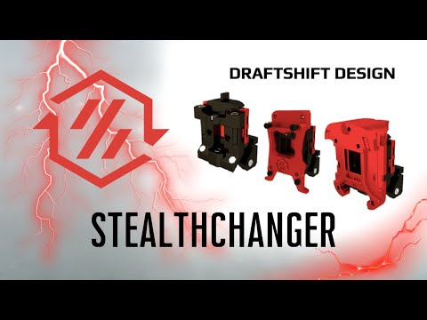

# MMU

## Filament management

### Passive spool holders

|                                                                                                                                                                                                                                         |                                                                                                                                                                                                                                    |                                                                                                                                                                                                                          |
| --------------------------------------------------------------------------------------------------------------------------------------------------------------------------------------------------------------------------------------- | ---------------------------------------------------------------------------------------------------------------------------------------------------------------------------------------------------------------------------------- | ------------------------------------------------------------------------------------------------------------------------------------------------------------------------------------------------------------------------ |
| 
<a href="https://github.com/Enraged-Rabbit-Community/ERCF_v2/tree/master/Recommended_Options/Filamentalist_Rewinder/Filamentalist_Classic_Rewinder">Filementalist classic</a> 
 | 
<a href="https://github.com/Enraged-Rabbit-Community/ERCF_v2/tree/master/Recommended_Options/Filamentalist_Rewinder/Filamentalist_FV3_Rewinder">Filamentalist F3</a> 
 | 
<a href="https://github.com/Enraged-Rabbit-Community/ERCF_v2/tree/master/Recommended_Options/Filamentalist_Rewinder/Filamentalist_Enclosure">Enclosure</a> 
 |

## MMU

|                                                           |                                                                                                          |                                  |
| --------------------------------------------------------- | -------------------------------------------------------------------------------------------------------- | -------------------------------- |
| ERCF V2                                                   | 
<figure><figcaption></figcaption></figure>
 | 
8-12-16 lanes 120 180$
 |
| [Tradrack](https://github.com/Annex-Engineering/TradRack) | 
<figure><figcaption></figcaption></figure>
 |                                  |
|                                                           |                                                                                                          |                                  |

### Motorized spool holders

|                                                         |                                                                                                          |           |
| ------------------------------------------------------- | -------------------------------------------------------------------------------------------------------- | --------- |
| [Boxturtle](https://github.com/ArmoredTurtle/BoxTurtle) | 
<figure><figcaption></figcaption></figure>
 | 4/8 spool |
| [Night owl](https://github.com/mjonuschat/NightOwl)     | 
<figure><figcaption></figcaption></figure>
 |           |
|                                                         |                                                                                                          |           |
